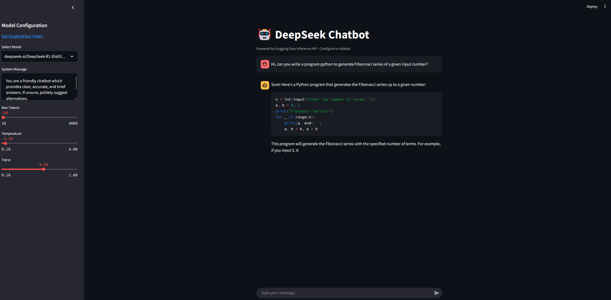

# AppDeepSeekChatbot  

AppDeepSeekChatbot is a chatbot application powered by DeepSeek's AI models. It allows users to interact with an AI assistant in natural language.  

## Features  
- **AI-powered chat**: Interact with the chatbot using natural language.  
- **Easy deployment**: Run the app locally or deploy it on a cloud platform.  
- **Streamlit-based UI**: Simple and intuitive user interface using Streamlit.  

## Installation  

1. Clone the repository:  
   ```sh
   git clone https://github.com/ndiaga21/AppDeepSeekChatbot.git
   cd AppDeepSeekChatbot

2. Create a virtual environment (optional but recommended):
    ```sh
    python -m venv venv
    source venv/bin/activate  # On macOS/Linux
    venv\Scripts\activate  # On Windows
3. Install dependencies:
    ```sh
    pip install -r requirements.txt

Run the application with:
    ```sh
    streamlit run app.py

Configuration
The application requires an API key ((obtenez-le [ici](https://huggingface.co/settings/tokens)))stored in .streamlit/secrets.toml. Make sure to create this file and add the following content:
api_key = "your_api_key_here"